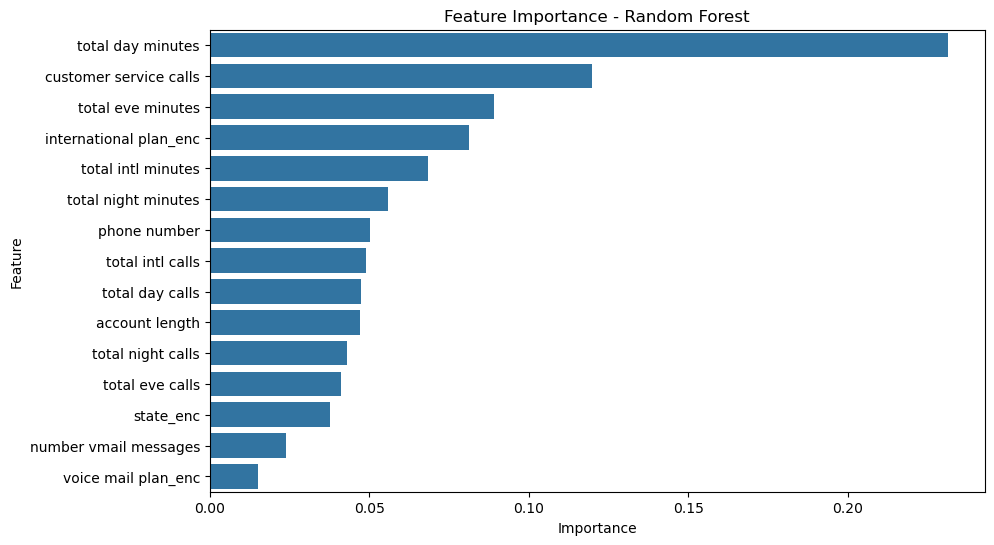
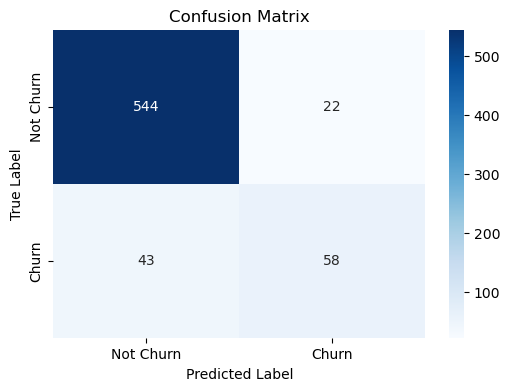
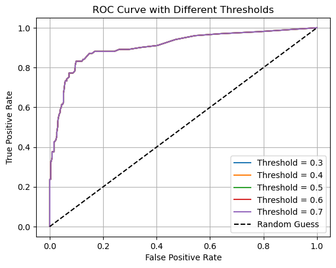

# **Customer Churn Prediction for SyriaTel**

## **Project Overview**
SyriaTel, a telecommunications provider, is facing high customer churn rates, which impact revenue, growth, and customer loyalty. This project leverages machine learning to predict churn, uncover its key drivers, and propose actionable retention strategies.

---

## **Table of Contents**
1. [Business Problem](#business-problem)
2. [Project Objectives](#project-objectives)
3. [Dataset Summary](#dataset-summary)
4. [Analysis and Modeling](#analysis-and-modeling)
    - [Data Preparation](#data-preparation)
    - [Key Features](#key-features)
    - [Modeling and Evaluation](#modeling-and-evaluation)
5. [Strategic Recommendations](#strategic-recommendations)
6. [Model Deployment](#model-deployment)

---

## **Business Problem**
SyriaTel's customer churn challenges threaten its revenue and growth. Identifying key churn drivers and predicting at-risk customers can help SyriaTel:
- Develop targeted retention strategies.
- Enhance customer service quality.
- Improve overall business performance.

---

## **Project Objectives**
1. **Understand Key Drivers of Customer Churn**
   - Analyze data to identify critical factors contributing to churn behavior.
   - Derive actionable insights for decision-making.

2. **Build an Accurate Predictive Model**
   - Develop machine learning models to classify churn risk.
   - Evaluate models using accuracy, precision, recall, and F1-score.

3. **Offer Strategic Recommendations**
   - Propose retention strategies based on predictions and insights.
   - Focus on high-risk customer engagement and loyalty improvement.

---

## **Dataset Summary**
- **Source**: SyriaTel Customer Churn Dataset from Kaggle.
- **Shape**: 3333 rows, 21 columns.
- **Features**: Customer account details, usage statistics, and subscription plans.
- **Target Variable**: `churn` (Yes/No).

---

## **Analysis and Modeling**

### **Data Preparation**
1. **Data Splitting**: Dataset split into training (80%) and testing (20%) subsets.
2. **Encoding**: Categorical variables (`voice mail plan`, `international plan`, `state`) encoded into numeric format.
3. **Feature Selection**:
   - Irrelevant features (e.g., `area code`) and highly correlated features were dropped to improve model performance.
4. **Feature Scaling**: Numerical features were standardized using `StandardScaler`.

---

### **Key Features**
- **Total Day Minutes**: Indicates customer engagement; lower usage correlates with higher churn.
- **Customer Service Calls**: High call frequency correlates with churn, highlighting service quality issues.

#### **Feature Importance**
The following graph shows the importance of each feature in predicting customer churn, helping to identify which features most influence the model's decisions.

---

### **Modeling and Evaluation**

#### **Random Forest Classifier**
- **Performance Metrics**:
  - Accuracy: **90.25%**
  - Precision (Churn): **0.65**
  - Recall (Churn): **0.67**
  - F1-Score (Churn): **0.66**

#### **Confusion Matrix**
Below is the confusion matrix for the Random Forest classifier, which helps visualize the model's performance on predicting churn versus non-churn customers.

#### **ROC Curve**
Below is the ROC curve for the Random Forest classifier, showcasing the trade-off between true positive rate and false positive rate.

#### **Cross-Validation**
- 5-fold cross-validation score: **91.26%**
- Demonstrates model consistency across subsets of data.

#### **Threshold Adjustment**
- Adjusted thresholds (e.g., 0.3, 0.5, 0.7) to balance precision and recall.
- Optimal threshold selected based on business goals.

#### **Model Comparison**
- **Decision Tree**: 86% accuracy.
- **Random Forest**: Outperformed Decision Tree in accuracy, recall, and F1-score.

---

## **Strategic Recommendations**
1. **Engage High-Risk Customers**
   - Use model predictions to identify high-risk customers (churn probability > 90%).
   - Offer loyalty rewards, discounts, or personalized plans to retain these customers.

2. **Improve Customer Service**
   - Focus on customers with high service call frequency.
   - Proactively resolve issues to enhance satisfaction.

3. **Personalized Retention Strategies**
   - Target low-engagement customers (low `Total Day Minutes`).
   - Offer incentives to increase usage and strengthen loyalty.

---

## **Model Deployment**
- **Trained Model**: Random Forest Classifier.
- **Saved Model**: Exported using `pickle` for deployment.
- **Usage**:
  - Predict churn for new customers.
  - Integrate predictions into SyriaTel’s CRM system for targeted outreach.

---

## **Business Insights**
1. **Key Churn Drivers**: Focus retention efforts on top features like `Total Day Minutes` and `Customer Service Calls`.
2. **Targeted Campaigns**: Allocate resources to high-risk customers for maximum impact.
3. **Enhanced Support**: Address customer service pain points to reduce churn risk.

---

**For further details, please refer to the project notebook.**
